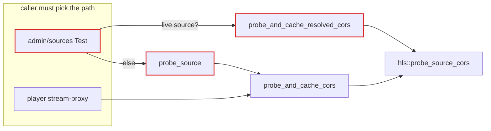
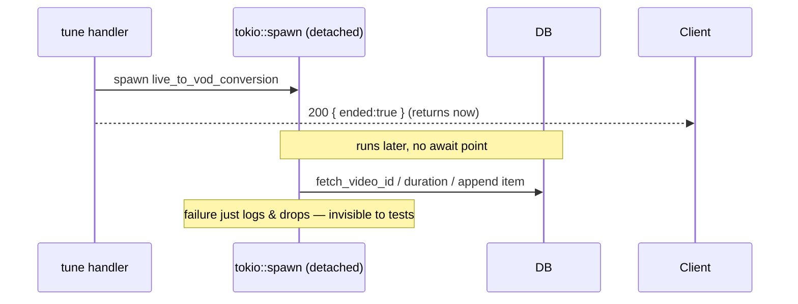
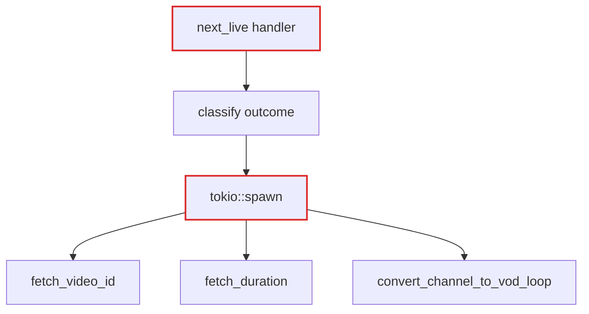
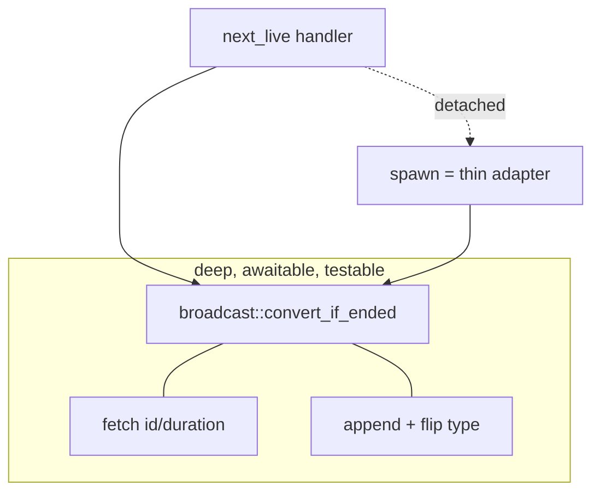

# Architecture review — MyTV

_2026-06-12 · Rust / Axum IPTV_

Five **deepening opportunities**, ranked. Each turns a **shallow** module — where the
interface is nearly as complex as the implementation — into a **deep** one: a lot of
behaviour behind a small interface.

No `CONTEXT.md` or `docs/adr/` present in the repo; domain language drawn from
`docs/architecture/`. No ADR conflicts found.

**Vocabulary** — _module_ (interface + implementation), _interface_ (everything a caller
must know), _seam_ (where an interface lives; a place behaviour can change without editing
in place), _adapter_ (a concrete thing satisfying an interface at a seam), _depth_
(leverage at the interface), _leverage_ (what callers get), _locality_ (what maintainers
get). _Deletion test_: imagine deleting the module — if complexity vanishes it was a
pass-through; if it reappears across N callers it was earning its keep.

---

## 1 · Deepen channel/source/playlist intake — **Strong**

`in-process · 2 adapters`

**Files**

- `src/routes/admin/channels.rs` (`channel_create:108`, `channel_update:179` — inline validation)
- `src/routes/api/channels.rs` (`parse_type` / `normalize_logo` / `resolve_anchor` / `validate_names:26–59`)
- `src/routes/admin/sources.rs` · `api/sources.rs` · `admin/playlist.rs` · `api/playlist.rs` (same split)

**Before — validation duplicated in both adapters**

```
   form adapter                 JSON adapter
 ┌──────────────────┐        ┌──────────────────┐
 │ parse_type        │        │ parse_type        │
 │ trim names        │  ◀══▶  │ trim names        │   same logic, copied
 │ normalize logo    │        │ normalize logo    │
 │ sort_order        │        │ sort_order        │
 │ resolve anchor    │        │ resolve anchor    │
 └────────┬─────────┘        └─────────┬────────┘
          └──────────┬──────────────────┘
                     ▼
        channel::create / update (model)
```

Interface ≈ implementation: each handler is mostly parse/trim/normalize. The JSON side
_already_ imports `parse_loop_anchor` from the form module — the seam exists but is only
half-built.

**After — one deep intake module**

```
   form adapter          JSON adapter
  → ChannelInput         → ChannelInput
          \                  /
           ▼                ▼
   ┌───────────────────────────────────────────┐
   │ ChannelInput::validate()  (deep)            │
   │ parse · trim · normalize · anchor           │
   │        → Result<NewChannel>                 │
   └───────────────────────┬─────────────────────┘
                           ▼
              channel::create / update (model)
```

Small interface (`validate() -> Result<NewChannel, _>`), all the rules behind it. Adapters
shrink to "deserialize, map error, render".

- **Problem** — the same parse/trim/normalize/anchor rules live in both the form handler
  and the JSON handler; they already drift (`StatusCode` vs `ApiError`, inline vs extracted).
- **Solution** — one `ChannelInput` (and sibling `SourceInput`, `PlaylistInput`) deep
  module that turns raw string fields into a validated `NewChannel`/`UpdateChannel`.

**Wins**

- Locality: validation bugs concentrate in one module
- Leverage: one interface, two adapters, N fields
- Interface shrinks; handlers absorb nothing
- Test the rules once, not through two transports

_Deletion test_: remove the module → validation reappears, copied, in every form and JSON
handler. It earns its keep.

---

## 2 · Narrow the health probe interface — **Worth exploring**

`in-process`

**Files**

- `src/health.rs` (`probe_source:123`, `probe_playlist_item:195`, `probe_and_cache_cors:230`, `probe_and_cache_resolved_cors:267`, `record_source_liveness:112`)
- callers: `admin/sources.rs:96+110` · `api/sources.rs:136` · `admin/playlist.rs:128` · `api/playlist.rs:145` · `player.rs:409`

**The interface is wide — caller must pick the path**



Five public probe entry points, and `admin/sources.rs` branches on "is this a live source?"
to choose between two of them before calling. The choice is the caller's burden — that's
the leak.

**Before → After (mass diagram)**

- Before — interface nearly as tall as implementation: **5 public fns** ≈ impl.
- After — interface `probe(target)` is short; impl absorbs the dispatch (live/http/dash).

- **Problem** — callers must know which of five probe functions applies, and replicate the
  "live source needs resolution first" branch.
- **Solution** — a single `probe(target) -> ProbeOutcome` that classifies the target
  (live/http/dash) and dispatches internally; keep `record_source_liveness` separate
  (different concern).

**Wins**

- Interface shrinks from 5 → ~2
- Locality: dispatch logic moves out of callers
- New probe kind = edit one module
- Test one interface with a target enum

_Deletion test_: the probe orchestration earns its keep — but its interface advertises its
internals. Deepen by hiding the dispatch.

---

## 3 · Give the ended-live → VOD flow a testable seam — **Worth exploring**

`in-process`

**Files**

- `src/routes/player.rs` (`next_live`, `live_to_vod_conversion:279`, `convert_channel_to_vod_loop:233`)

**Before — fired as a detached task, invisible to tests**



The conversion is fired as a detached task, so a test driving `/tune` can't observe whether
the VOD was appended. Tests today reach _past_ the handler and call
`convert_channel_to_vod_loop` directly — the interface is not the test surface.

**Before — logic tangled in handler + spawn**



**After — deep core, spawn is just an adapter**



- **Problem** — the conversion's correctness (idempotency, failure handling, anchor) is
  only reachable by bypassing the handler; the spawn hides it from the request path's tests.
- **Solution** — extract a `broadcast::convert_if_ended(...)` deep module with a
  synchronous, awaitable core that returns an outcome; the `tokio::spawn` becomes a one-line
  adapter over it.

**Wins**

- The interface becomes the test surface
- Locality: idempotency + failure modes in one place
- Handler shrinks to "call, spawn, respond"
- Tests stop reaching past the seam

_Deletion test_: the conversion logic concentrates real complexity (atomic flip,
idempotency) — it earns a module; today it just lacks a clean seam.

---

## 4 · Collapse the stream-proxy fetch loop into a deep module — **Worth exploring**

`in-process`

**Files**

- `src/routes/player.rs` (`stream_proxy:374–566` — ~193 lines)

**Before — one opaque 193-line handler**

```
│ scheme validation
│ SSRF check
│ 5-attempt redirect loop
│ playlist detection
│ HLS vs DASH rewrite
│ segment streaming + metrics
```

All six concerns inline in the HTTP handler. Add a manifest format → patch this function.

**After — thin handler over a deep fetch module**

```
│ handler: extract url, stream response
└─▶ ┌──────────────────────────────────────────┐
    │ proxy::fetch_rewritten(url)   (deep)        │
    │  ┌───────────────────────────────────────┐ │
    │  │ ssrf · redirect-follow · detect ·     │ │  (now internal)
    │  │ rewrite                                │ │
    │  └───────────────────────────────────────┘ │
    └──────────────────────────────────────────┘
```

Redirect-follow, SSRF, detection and rewrite become internal seams of one module. The
handler only knows `fetch_rewritten(url) -> Response`.

- **Problem** — HTTP plumbing and proxy business logic are interleaved in one long handler;
  rewrite changes mean editing the request handler.
- **Solution** — a `proxy` module exposing `fetch_rewritten(url) -> Response`, with
  redirect/SSRF/detect/rewrite as internal seams (the latter two already partly in
  `media::hls/mpd`).

**Wins**

- Handler returns to HTTP-only concerns
- Leverage: proxy logic testable without a router
- New format = edit one internal seam
- Locality: redirect/SSRF rules in one module

---

## 5 · Fold the budget-badge dance behind the row build — **Speculative**

`in-process`

**Files**

- `src/routes/admin/channels.rs:292` · `admin/sources.rs:123` · `admin/playlist.rs:141`

**Before — repeated 3-line dance**

```rust
let cors = state.cors_cache.read().await.clone();
let row: AdminRow = x.into();
row.apply_budget(&cors);
```

Same incantation in every admin handler that renders a row. Pure pass-through — forget
`apply_budget` and the badge silently goes blank.

**After — one builder owns it**

```rust
let rows = AdminRow::build(items, &state.cors_cache).await;
```

The cache read + budget apply live inside the builder. Callers can't forget the step
because they don't perform it.

- **Problem** — the badge-fill step is a manual ritual repeated across handlers; easy to
  omit, never reused.
- **Solution** — a row-builder that reads the cache and applies the budget internally,
  returning ready-to-render rows.

**Wins**

- Locality: badge logic in one builder
- Removes a forgettable manual step
- Smallest payoff of the five

_Speculative: low mass. Worth doing opportunistically when next touching these handlers,
not as standalone work._

---

## Top recommendation

**Start with #1 — deepen channel/source/playlist intake.**

It is the only **Strong** candidate, and the seam is already half-built: the JSON adapter
extracted `parse_type`/`normalize_logo`/`resolve_anchor` and even reaches into the form
module for `parse_loop_anchor`. Two real adapters (form + JSON) justify the seam today; you
are completing a deepening the code is already drifting toward, not inventing one. Highest
leverage, clearest locality win, and it shrinks six handlers at once.
