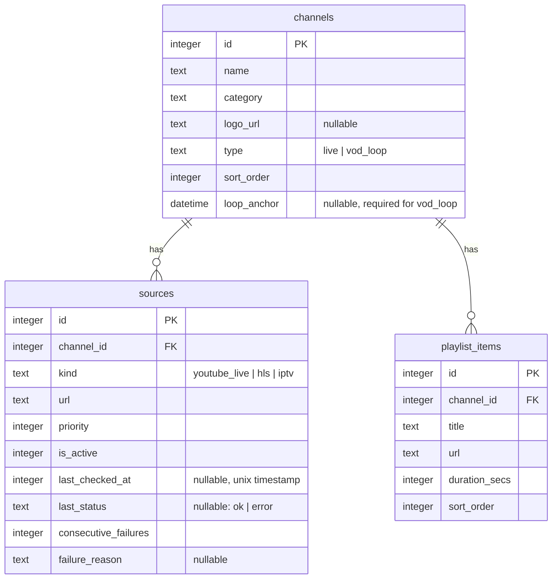

# Database Schema

Three tables. Channels own sources and playlist items; both child tables cascade on delete.

## Notes

**`loop_anchor`** is a fixed UTC timestamp set when a `vod_loop` channel is created. It serves as the epoch for the VOD position calculation — the playlist cycles continuously from this point forward. It is never updated.

**`ON DELETE CASCADE`** is set on both `sources.channel_id` and `playlist_items.channel_id`. Deleting a channel removes all its sources and playlist items in one operation.

**Health columns** (`last_checked_at`, `last_status`, `consecutive_failures`, `failure_reason`) were added in `migrations/002_source_health.sql`. They are written only by the background health checker — never by CRUD routes.

**`sources.priority`** determines the order in which sources are tried during tuning (`ORDER BY priority ASC`). Lower number = tried first.
