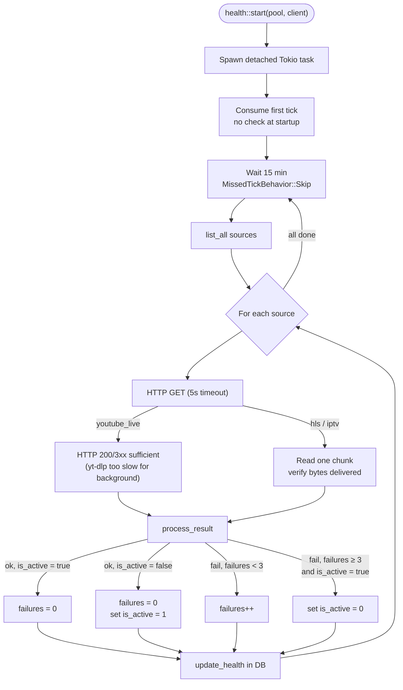
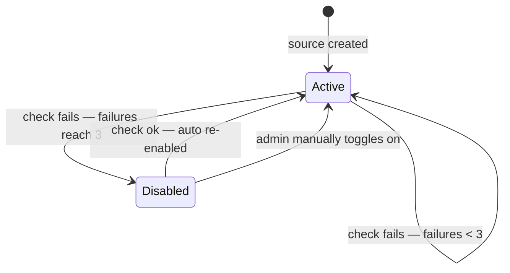

# Health Checker & Source State Machine

A background Tokio task checks every source URL every 15 minutes and auto-disables sources that fail repeatedly. Sources that recover are automatically re-enabled on the next successful check.

## Tick Loop

## Source State Machine

## Notes

**Auto-re-enable.** When a disabled source passes a health check, `process_result` returns `HealthAction::Reenable` and `update_health` sets `is_active = 1`. The source returns to active rotation immediately on the next check cycle — no cooldown period. The `HealthAction` enum (private to `health.rs`) makes the three outcomes — `Disable`, `Reenable`, `None` — mutually exclusive.

**Why `MissedTickBehavior::Skip`?** If a full check round (many sources all timing out at 5s each) takes longer than 15 minutes, any missed ticks are dropped rather than queued. This prevents a backlog of back-to-back check rounds after a slow cycle.

**First tick consumed.** The task calls `interval.tick().await` once immediately after spawning before entering the loop, which discards the initial zero-delay tick. Sources are not checked at startup.

**youtube_live shortcut.** Checking a YouTube live stream via yt-dlp takes several seconds and is too slow for a background health check. Instead, only the HTTP response status is checked (200 or 3xx is sufficient). The source is considered healthy if the page loads.
