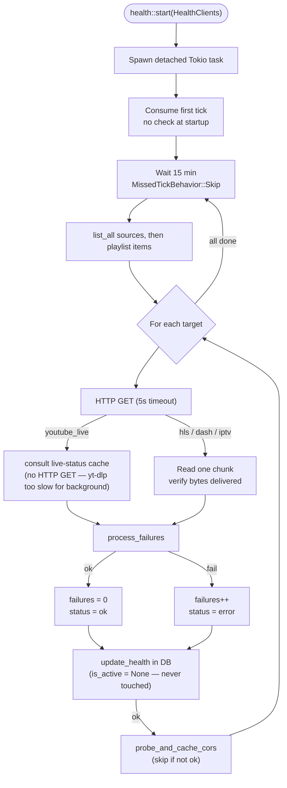
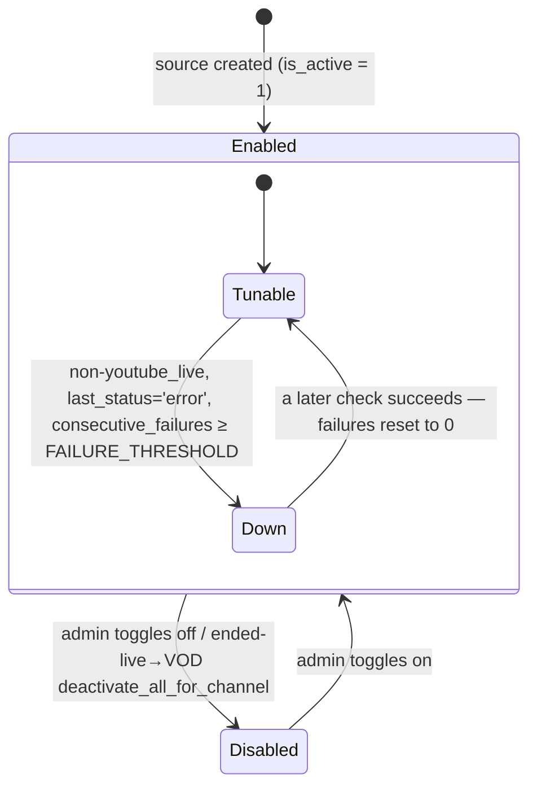

# Health Checker & Source Availability

A background Tokio task checks every source and playlist URL every 15 minutes and records the result (`last_status`, `consecutive_failures`, `failure_reason`). It **never changes `is_active`** — that flag is the admin's manual gate alone. Whether a source is actually *tunable* is not stored; it is computed at tune time from the recorded health fields.

## Tick Loop



`process_failures(consecutive_failures, ok)` is a pure counter: `ok` resets to `0`, a failure returns `consecutive_failures + 1`. Every health write — background checks, the interactive `record_source_liveness` poll, and the manual `probe` Test button — passes `is_active = None` to `update_health`.

## Tune-time Availability

"Down" is **not a stored flag**. The tune path asks `source::list_tunable_for_channel`, which returns sources that are both manually enabled and not observed-Down:

```
tunable  ⇔  is_active = 1  AND NOT is_observed_down(kind, last_status, consecutive_failures)
```



The `Tunable ⇄ Down` transition is a *view* over the recorded counter, recomputed on every tune — nothing in the DB flips. A source recovers automatically the moment a check resets its failure count below the threshold; no cooldown.

**`is_observed_down` is the single source of truth** for the Down rule, and `FAILURE_THRESHOLD` (both in `src/model/source.rs`) is the single source of truth for the threshold. `list_tunable_for_channel` filters in Rust through that predicate rather than embedding the rule in SQL, so the threshold cannot skew between code paths.

**`youtube_live` is exempt from Down.** A `youtube_live` source is kept in rotation even after repeated "not currently live" errors, so the resolve-time waiting/backoff path (idea #38) can fire. Only non-`youtube_live` sources are filtered out by failure count.

## Notes

**`health::start` takes `HealthClients`.** The struct bundles `pool`, `http_client`, `cors_cache`, and `live_cache` so the checker can update both health fields and the CORS badge cache in one pass.

**CORS probing.** After a target's HTTP check succeeds, `probe_and_cache_cors` sends a CORS preflight to the CDN and caches the result (keyed by host) in the shared `CorsCache`. Hosts are deduped within a cycle (a `HashSet`) so each CDN is probed at most once. Non-HTTPS and resolution-needed (YouTube/Twitch) URLs are skipped; resolution-needed *live* sources are resolved first so the real segment CDN is probed.

**`probe` vs `check_source`.** The admin and JSON-API Test buttons call `probe(ProbeTarget::Source | PlaylistItem)`, which runs the same HTTP check, updates `last_status`/`consecutive_failures`, and additionally warms the CORS cache (resolving live sources / marking VOD hosts Direct internally). `check_source` is the background-loop path and does not warm CORS beyond the per-cycle dedup. **Neither path changes `is_active`** — both pass `is_active = None`. The only writers of `is_active` are the admin toggle (`set_active`) and the ended-live→VOD conversion (`deactivate_all_for_channel`).

**Why `MissedTickBehavior::Skip`?** If a full check round (many targets all timing out at 5s each) takes longer than 15 minutes, any missed ticks are dropped rather than queued. This prevents a backlog of back-to-back check rounds after a slow cycle.

**First tick consumed.** The task calls `interval.tick().await` once immediately after spawning before entering the loop, which discards the initial zero-delay tick. Targets are not checked at startup.

**youtube_live shortcut.** Resolving a YouTube live stream via yt-dlp takes several seconds and is too slow to run inline in a background health check. Instead, `do_http_check` consults the shared **live-status cache** for `youtube_live` sources — it makes no HTTP GET. The cached `LiveStatus` maps to health via `live_status_health`: `Live`/`Upcoming`/`Unknown` count as ok (a scheduled stream isn't broken; `Unknown` is a load-shed or extractor gap), `Offline`/`NotLive` as "not currently live", and `WasLive`/`PostLive` as "broadcast ended". Playlist-item checks pass no live cache, so a `youtube_live`-detected VOD item is treated as ok without spending a yt-dlp probe.
