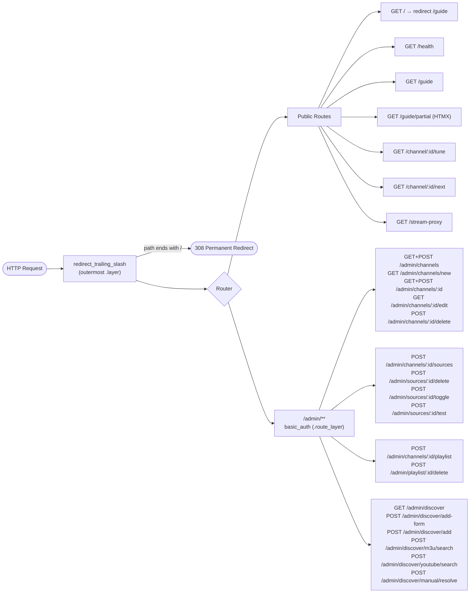

# Request & Route Map

Every HTTP request passes through one middleware layer before reaching a handler.

## Notes

**Middleware order matters.** `redirect_trailing_slash` is registered with `.layer()` (outermost), so it fires before route matching *and* before auth. A request to `GET /admin/` gets a 308 redirect without ever hitting the `basic_auth` middleware. Use `/admin` (no trailing slash) to test authentication.

**Auth scope.** `basic_auth` is registered with `.route_layer()` scoped to the admin sub-router only. Public routes (`/guide`, `/channel/:id/tune`, etc.) require no credentials.

**Player routes return JSON.** `/channel/:id/tune` and `/channel/:id/next` return `Json<TuneResponse>` with HTTP 200 on success or HTTP 503 on failure — they do not redirect or return HTML.
