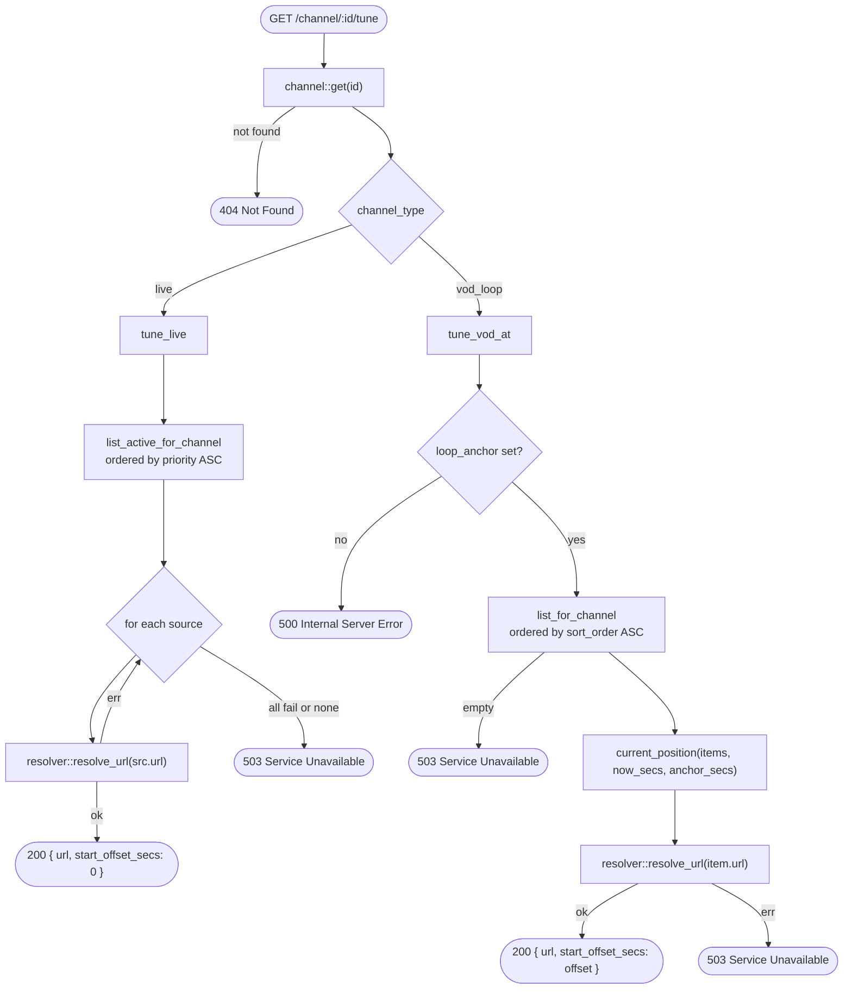
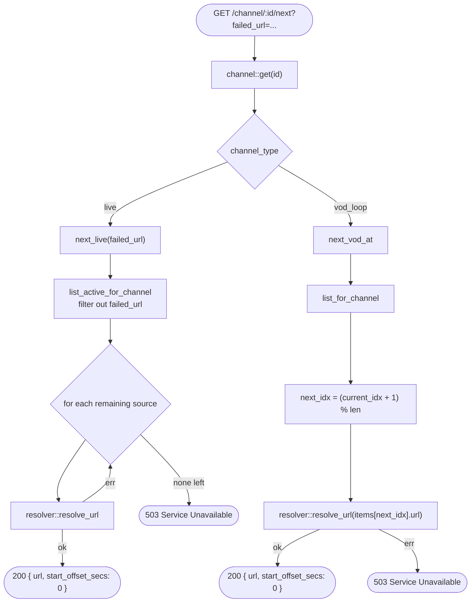

# Tune Flow

How `/channel/:id/tune` and `/channel/:id/next` select a stream URL and return it to the player.

## `/tune` — Initial Tune



## VOD Position Calculation

`current_position` determines which playlist item is currently airing and how far into it.

```
total      = sum of all item duration_secs
elapsed    = (now_secs − anchor_secs) rem_euclid total
walk items accumulating durations until elapsed < accumulated
offset     = elapsed − (accumulated − item.duration_secs)
```

`rem_euclid` is used instead of `%` so the result is always non-negative even if `anchor_secs` is in the future relative to `now_secs`.

## `/next` — Fallback to Next Source



## Notes

**`failed_url` is the raw source URL**, not the resolved playable URL. The player passes the original URL it was given so the server can match it against `src.url` directly.

**Fallback is one level deep.** `/next` skips exactly one named URL. If all other active sources also fail to resolve, 503 is returned immediately — there is no retry loop beyond the source list.

**VOD `start_offset_secs`.** The player uses this value to seek mid-episode, making the channel behave like a broadcast schedule where every viewer sees the same content at the same time.

**VOD `/next` ignores `failed_url`.** The VOD next handler advances to the next playlist item by index and ignores the `failed_url` parameter entirely — VOD items don't have fallback sources.
