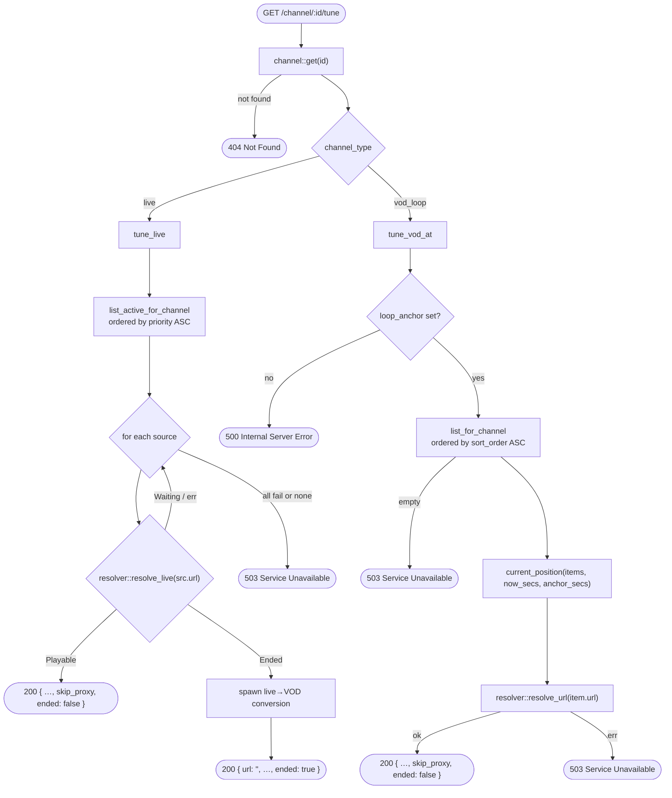
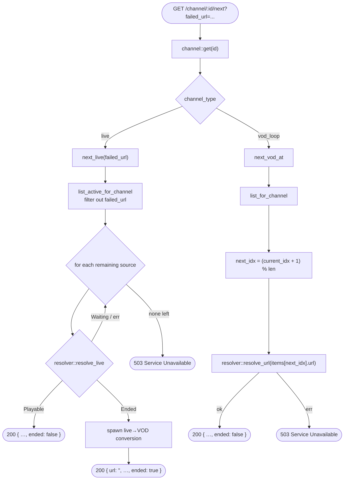

# Tune Flow

How `/channel/:id/tune` and `/channel/:id/next` select a stream URL and return it to the player.

## `/tune` — Initial Tune



Every success response carries two extra booleans beyond the metadata fields: `skip_proxy` (the player points `<video>` straight at the resolved CDN URL when `true` — see `ytdlp-resolution.md`) and `ended` (signals a broadcast that has finished — see below). The full payload is `{ url, start_offset_secs, name, logo_url, category, channel_type, skip_proxy, ended }`.

## VOD Position Calculation

`current_position` determines which playlist item is currently airing and how far into it.

```
total      = sum of all item duration_secs
elapsed    = (now_secs − anchor_secs) rem_euclid total
walk items accumulating durations until elapsed < accumulated
offset     = elapsed − (accumulated − item.duration_secs)
```

`rem_euclid` is used instead of `%` so the result is always non-negative even if `anchor_secs` is in the future relative to `now_secs`.

## `/next` — Fallback to Next Source



## Ended Live → VOD Conversion

Resolution returns a closed `resolver::LiveResolution` enum — `Playable { url }`, `Ended`, or `Waiting` — so an unplayable state can never reach the player as a URL. The resolver itself decides `Ended` when yt-dlp's `live_status` is `was_live` (recording processed) or `post_live` (just ended), or — as a fallback for extractors without `live_status` — when a `force_finished/1` manifest is detected (`classify_resolved`). `next_live` simply matches on the variant; on `Ended` the handler does **not** return the dead manifest. Instead it:

1. Fires a detached `tokio::spawn` task (`broadcast::spawn_conversion`) and returns `TuneResponse { ended: true, url: "" }` immediately.
2. The frontend shows a brief "Stream ended — switching…" overlay and auto-advances to the next channel in the lineup (loop-guarded, cancelled on a manual tune).

The background task (`broadcast::spawn_conversion` → `broadcast::convert_if_ended`, with the watch-url/duration resolution injected as `broadcast::resolve_recording`):

```
watch_url = live_url_to_watch_url(source_url)            # youtube.com/live/<id> → watch?v=<id>
          ?? "watch?v=" + fetch_video_id(source_url)     # fallback for handle/channel /live forms
duration  = fetch_duration_secs(watch_url)               # the injected resolve_recording step
if !channel::set_type_and_anchor_if_live(VodLoop, anchor = now): return AlreadyConverted
create playlist_item { url: watch_url, duration, sort_order: 0 }
source::deactivate_all_for_channel(...)
```

Resolution runs **before** the claim, so a failed resolve leaves the channel live (an empty VOD would 503). The `set_type_and_anchor_if_live` flip is both the type change and the idempotency gate. The conversion is **idempotent** — a channel already in `vod_loop` loses the claim and is left untouched, so concurrent tunes that both observe the ended manifest don't create duplicate items. No schema migration was needed: the recording URL lives on the new `playlist_item`, not the source.

## Notes

**`failed_url` is the raw source URL**, not the resolved playable URL. The player passes the original URL it was given so the server can match it against `src.url` directly.

**Fallback is one level deep.** `/next` skips exactly one named URL. If all other active sources also fail to resolve, 503 is returned immediately — there is no retry loop beyond the source list.

**VOD `start_offset_secs`.** The player uses this value to seek mid-episode, making the channel behave like a broadcast schedule where every viewer sees the same content at the same time.

**VOD `/next` ignores `failed_url`.** The VOD next handler advances to the next playlist item by index and ignores the `failed_url` parameter entirely — VOD items don't have fallback sources.

**Channel metadata in response.** `/tune` and `/next` both include `name`, `logo_url`, `category`, and `channel_type` so the client can render the info bar without a separate fetch.

**`skip_proxy` and `ended` flags.** `skip_proxy` tells the player to use the unproxied resolved URL for `<video src>` (set for resolved YouTube VOD direct MP4s). `ended` signals the live broadcast has finished and conversion has been triggered — the client treats it as a cue to auto-advance, not an error.
