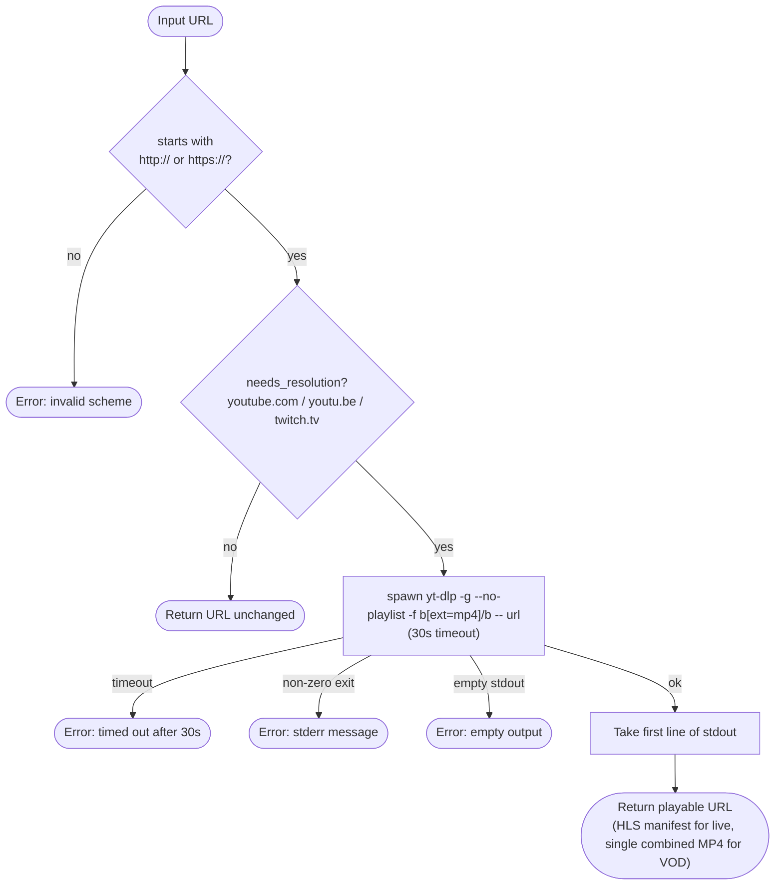

# yt-dlp Resolution Chain

How a raw source URL becomes a directly playable stream URL.

## `resolve_url` — Called at Tune Time

The `-f b[ext=mp4]/b` format selector asks yt-dlp for a single combined MP4 stream when one exists (the typical YouTube VOD case), falling back to the best available format otherwise. A combined MP4 plays directly in a native `<video>` element with no manifest, which is what lets the player bypass `/stream-proxy` for resolved YouTube VOD URLs (see "Direct-MP4 bypass" below).

## `fetch_duration_secs` — Called at Admin Time

`fetch_duration_secs` is called once when an admin adds a VOD playlist item. The result is stored in `playlist_items.duration_secs` so the tune-time position calculation does not need to call yt-dlp again.

## Other yt-dlp helpers

| Helper | When | Purpose |
|--------|------|---------|
| `fetch_title` | Admin manual-URL resolve | Pre-populates the channel name field from the video title. |
| `fetch_video_id` | Ended-live → VOD conversion | Returns the canonical video id for `/live` URLs that carry no id in the path (channel/handle forms), so a `watch?v=<id>` URL can be built. |

## Pure (no-yt-dlp) helpers

These run synchronously without spawning a process — they are string transforms used by the tune flow and the ended-live → VOD conversion (see `tune-flow.md`):

- **`needs_resolution(url)`** — substring match on `youtube.com` / `youtu.be` / `twitch.tv`; gates everything above and feeds `TuneResponse.skip_proxy`.
- **`is_finished_live(resolved_url)`** — `true` when the resolved manifest contains `force_finished/1`, the marker yt-dlp emits for a live broadcast that has ended. The tune flow uses this to trigger conversion instead of black-screening.
- **`live_url_to_watch_url(source_url)`** — rewrites `youtube.com/live/<id>` or `youtu.be/<id>` into the canonical `watch?v=<id>` form (which yt-dlp resolves to the recording once the broadcast ends). Returns `None` for handle/channel `/live` forms with no id in the path — those fall back to `fetch_video_id`.

## Notes

**yt-dlp is optional.** If the binary is not installed, `resolve_url` returns an error for YouTube/Twitch URLs. The caller (tune flow) treats this as a source failure and moves on to the next source, or returns 503 if no sources remain.

**`needs_resolution` is pattern-based.** The check is a substring match on the URL — no HTTP probe is made. Vimeo and other platforms are not in the list; their URLs pass through unchanged and will typically fail to play in HLS-only players.

**Sequential resolution.** For a live channel with multiple YouTube sources, resolution attempts run one at a time. Each can take up to 30 seconds before timing out. A channel with three YouTube sources could wait up to 90 seconds before returning 503.

**First line only.** yt-dlp can return multiple URLs (e.g. different quality levels). Only the first line of stdout is used.

**Direct-MP4 bypass.** When `resolve_url` returns a combined MP4 (resolved YouTube VOD), the tune handler sets `TuneResponse.skip_proxy = true` (derived from `needs_resolution`). The player then points `<video src>` at the googlevideo CDN URL directly instead of routing it through `/stream-proxy`, so VOD bytes go CDN → browser with no Fly egress. Live HLS manifests still proxy as before.
