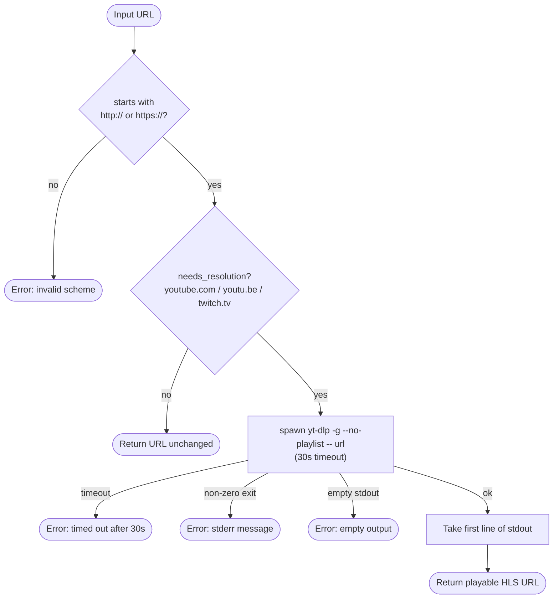
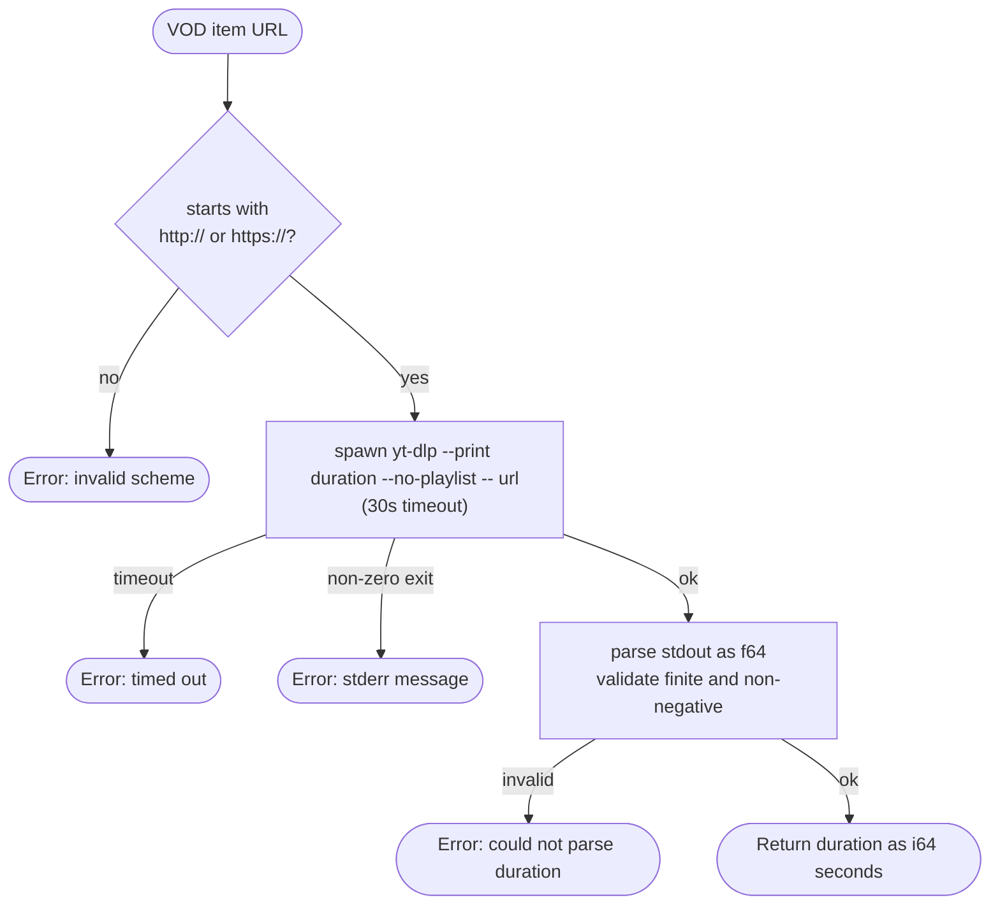

# yt-dlp Resolution Chain

How a raw source URL becomes a directly playable stream URL.

## `resolve_url` — Called at Tune Time

## `fetch_duration_secs` — Called at Admin Time

`fetch_duration_secs` is called once when an admin adds a VOD playlist item. The result is stored in `playlist_items.duration_secs` so the tune-time position calculation does not need to call yt-dlp again.

## Notes

**yt-dlp is optional.** If the binary is not installed, `resolve_url` returns an error for YouTube/Twitch URLs. The caller (tune flow) treats this as a source failure and moves on to the next source, or returns 503 if no sources remain.

**`needs_resolution` is pattern-based.** The check is a substring match on the URL — no HTTP probe is made. Vimeo and other platforms are not in the list; their URLs pass through unchanged and will typically fail to play in HLS-only players.

**Sequential resolution.** For a live channel with multiple YouTube sources, resolution attempts run one at a time. Each can take up to 30 seconds before timing out. A channel with three YouTube sources could wait up to 90 seconds before returning 503.

**First line only.** yt-dlp can return multiple URLs (e.g. different quality levels). Only the first line of stdout is used.
