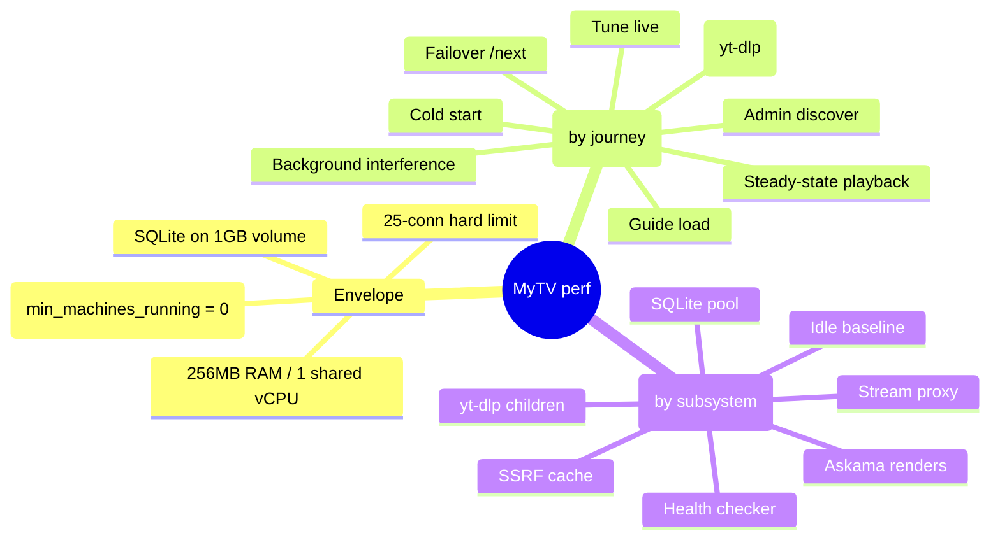

# MyTV Performance Framework

A map of what to measure, how, and the recorded baselines. Structure: **Envelope → Latency (by user journey) → Memory (by subsystem)**. The definition of done for this framework is *baselines recorded*, not optimizations made — optimization work is a separate, evidence-driven follow-up.

## Envelope

Constraints everything lives under (from `fly.toml`):

| Constraint | Value | Implication |
|---|---|---|
| RAM | 256MB | yt-dlp child processes are the biggest OOM risk |
| CPU | 1 shared vCPU | Health-checker bursts compete with foreground requests |
| Connections | hard 25 / soft 20 | Bounds worst-case proxy memory: 25 × per-conn buffers |
| Machines | `min_machines_running = 0` | First request after idle pays full machine boot |
| Storage | SQLite on 1GB Fly volume | Volume I/O latency affects every query |

## Latency — by user journey

Each leaf: *what to measure / tool / hypothesis*.

### Cold start
- **Path**: Fly machine boot → app start (migrations) → first response.
- **Measure**: `curl -w '%{time_total}'` against the live app after `fly machine stop`; compare with warm request.
- **Tool**: curl timing; `fly logs` for boot breakdown.
- **Hypothesis**: machine boot dominates (seconds); app start is fast (small binary, few migrations).

### Tune live (`GET /channel/:id/tune`)
- **Path**: DB source lookup → SSRF check (DNS on 60s-cache miss) → upstream manifest ops → JSON.
- **Measure**: warm vs cold SSRF-cache latency split; p50/p99 via `/admin/metrics` histogram.
- **Tool**: `scripts/perf/tune-bench.sh` (hyperfine), `/admin/metrics`.
- **Hypothesis**: upstream network dominates; local work is <5ms.

### Tune VOD (`GET /channel/:id/tune`, vod_loop channels)
- **Path**: position calc → playlist query → yt-dlp resolution when URL needs it.
- **Measure**: tune latency for a yt-dlp-backed item vs a direct HLS item.
- **Tool**: hyperfine; `time yt-dlp -g <url>` in isolation.
- **Hypothesis**: yt-dlp subprocess dominates (seconds — Python startup + YouTube API roundtrips).

### Steady-state playback (`GET /stream-proxy`)
- **Path per manifest refresh** (~every 2–6s while watching): SSRF check → upstream fetch (full buffer ≤20MB cap) → `rewrite_hls_urls` → response. Segments: streamed, no buffering.
- **Measure**: proxy TTFB for manifests vs direct upstream fetch (the proxy overhead delta); segment TTFB proxied vs direct.
- **Tool**: curl timing against live instance at low rate; `benches/hot_paths.rs` for rewrite compute.
- **Hypothesis**: overhead ≈ one extra network hop; rewrite compute is microseconds.

### Failover (`GET /channel/:id/next`)
- **Path**: failed_url match → next source by priority → same resolve path as tune.
- **Measure**: end-to-end /next latency with 1 vs N dead sources ahead of the good one.
- **Tool**: hyperfine against seeded local data (seed channel 3 "Has Fallback").
- **Hypothesis**: linear in dead-source count × per-attempt timeout.

### Guide load (`GET /guide`, `GET /guide/partial`)
- **Path**: channels query → per-channel EPG window calc (`epg::vod_schedule`) → layout slots → budget badges → Askama render.
- **Measure**: p50/p99 under load; scaling with channel count and playlist length.
- **Tool**: `scripts/perf/load-guide.sh` (oha), `benches/hot_paths.rs` (`epg::vod_schedule`).
- **Hypothesis**: linear in channels × playlist items; single-digit ms at personal scale.

### Admin discover
- **Path**: YouTube API roundtrip / M3U download + `parse_m3u`.
- **Measure**: parse time for a 10k-channel M3U (bench); end-to-end is network-bound.
- **Tool**: `benches/hot_paths.rs` (`m3u::parse_m3u`).
- **Hypothesis**: parse is ms-scale even at 10k channels; download dominates.

### Background interference
- **Path**: health checker (15-min tick, `MissedTickBehavior::Skip`) probes all sources, sharing the reqwest client and 1 vCPU.
- **Measure**: guide/tune p99 with health check forced concurrent vs quiet.
- **Tool**: oha while a check cycle runs; compare `/admin/metrics` histograms.
- **Hypothesis**: negligible — network-bound probes, little CPU.

## Memory — by subsystem

| Subsystem | What's held | Bound | Risk | How to verify |
|---|---|---|---|---|
| Stream proxy: segments | streamed chunks only (`Body::from_stream`, `player.rs`) | per-conn chunk size × 25 conns | Low | RSS under `oha`-driven proxy load |
| Stream proxy: manifests | full body buffered before rewrite | 20MB cap × concurrent manifest requests | Medium | RSS while N manifest refreshes in flight |
| yt-dlp children | Python interpreter per resolution | **uncapped concurrency** | **High — #1 OOM risk** | `ps` RSS of yt-dlp during resolve; count max concurrent |
| SQLite pool | connections × page cache | pool default (check `db.rs`) | Low | idle RSS delta vs pool size |
| SSRF cache | hostname → Instant | unbounded map, entries never evicted (only re-validated) | Low (personal-scale hostname set) | `/admin/metrics` `caches.ssrf_entries` over time |
| CORS cache | origin (`scheme://host`) → bool | unbounded, same profile | Low | `/admin/metrics` `caches.cors_entries` |
| Health checker | health probe reads a single chunk (`do_http_check`); CORS probe (`fetch_text`) buffers the full manifest | one manifest per CORS probe, sequential | Low–Medium (huge upstream manifest) | RSS during a check cycle |
| Askama renders | per-request guide HTML string | channels × slots × template size | Low | response Content-Length as proxy |
| Idle baseline | tokio runtime + binary + pool | — | reference | `/admin/metrics` `rss_bytes` after boot, no traffic |

## Tooling inventory

| Tool | What for | Where |
|---|---|---|
| `/admin/metrics` | live RSS, per-route latency histograms, proxy counters, cache sizes | in-app, behind basic auth |
| `benches/hot_paths.rs` | criterion micro-benches of pure hot functions | `cargo bench` |
| `scripts/perf/load-guide.sh` | oha load test of guide routes | local server |
| `scripts/perf/tune-bench.sh` | hyperfine tune latency distribution | local server |
| `scripts/perf/README.md` | profiling recipes: flamegraph, heap, Fly, cold start | docs |

## Baselines

Fill local from `cargo bench` + scripts against a release build with seed data. Fill live after the metrics endpoint is deployed. Re-record after any perf-relevant change.

| # | Metric | How | Local (2026-06-04) | Live (2026-06-04) |
|---|---|---|---|---|
| 1 | Idle RSS | `/admin/metrics` `rss_bytes` after boot | — (None on macOS) | — (pending) |
| 2 | Guide p50 / p99 @ 5 conns, 30s | `load-guide.sh` | 1.00 ms / 1.69 ms [^curl] | 65 ms / 123 ms [^live] |
| 3 | Guide partial p50 / p99 | `load-guide.sh` | 0.92 ms / 1.81 ms [^curl] | 54 ms / 84 ms [^live] |
| 4 | Tune (live ch) mean ± σ | `tune-bench.sh 1` | 0.80 ms ± 0.14 ms [^curl] | 52.2 ms ± 2.6 ms [^tune503] |
| 5 | Tune (VOD ch) mean ± σ | `tune-bench.sh 4` | 0.91 ms ± 0.21 ms [^curl] | 52.2 ms ± 2.2 ms [^live] |
| 6 | `epg::vod_schedule` 200 items / 4h | `cargo bench` | 850 ns | n/a |
| 7 | `rewrite_hls_urls` 2000 segments | `cargo bench` | 2.72 ms | n/a |
| 8 | `parse_m3u` 10k channels | `cargo bench` | 3.78 ms | n/a |
| 9 | `budget::status_for_url` cache hit | `cargo bench` | 62.4 ns | n/a |
| 10 | Cold start (stop → first /health 200) | curl timing | n/a | 1.80 s (warm: ~65 ms) |
| 11 | Proxy manifest overhead (proxied − direct TTFB) | curl timing vs real upstream | n/a | ≈ +80 ms (280 vs 201 ms median, n=7) |
| 12 | yt-dlp resolve wall time + peak child RSS | `time yt-dlp -g` + `ps` | — [^ytdlp] | — (no yt-dlp-backed channels configured) |

Local numbers from macOS arm64, release build; tune/guide latencies measured via `curl -w time_total` (25 sequential runs) against localhost with seed data — `oha`/`hyperfine` were not available, so p99 is the sample maximum and "mean ± σ" uses curl process overhead (~1–2 ms round-trip to localhost rather than the ~5–10 ms noted for hyperfine); bench rows 6–9 use criterion slope point estimates from `target/criterion/*/new/estimates.json`; RSS is Linux-only and not measurable locally.

Live numbers measured 2026-06-04 from a client in Stockholm against the AMS instance over the public internet — they include ~50 ms client↔server RTT, which dominates every row (app-side compute is sub-millisecond per the Local column).

[^curl]: `oha`/`hyperfine` not installed; measured with 25 sequential `curl -w %{time_total}` calls; p99 is sample max (n=24 after dropping first warmup); values include curl process overhead.
[^ytdlp]: `yt-dlp -g` returned HTTP 400 from YouTube (no valid session locally); wall time and RSS not measured.
[^live]: 20–25 sequential `curl -w %{time_total}` samples against kunstv.fly.dev; p99 is sample max.
[^tune503]: both live channels' upstream sources were down (auto-disabled) at measurement time, so this row records the 503 failure path, not a successful tune.
