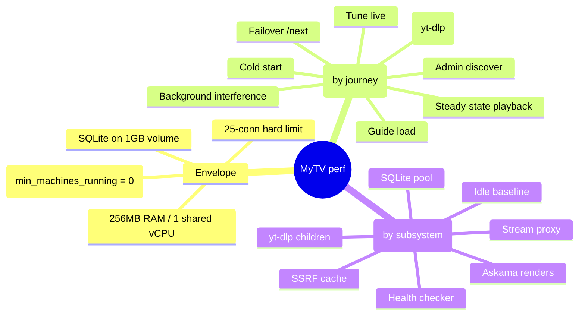

# Performance Analysis Framework Implementation Plan

> **For agentic workers:** REQUIRED SUB-SKILL: Use superpowers:subagent-driven-development (recommended) or superpowers:executing-plans to implement this plan task-by-task. Steps use checkbox (`- [ ]`) syntax for tracking.

**Goal:** Build a performance analysis framework for MyTV: a framework doc (mind map + baseline table), criterion micro-benchmarks, load-test scripts, and a light `/admin/metrics` endpoint observable on the live Fly.io instance.

**Architecture:** A new `src/metrics.rs` module holds a hand-rolled `Arc<Metrics>` (atomics, no new heavy deps) stored in `AppState`. A tower `route_layer` middleware records per-route latency via `MatchedPath`. The stream proxy increments byte/gauge counters. A new `/admin/metrics` route (behind existing basic auth) serializes a JSON snapshot. Benches and scripts live outside the app.

**Tech Stack:** Rust 1.96 (pinned), Axum 0.7, criterion 0.5 (dev-dep), futures-util (already transitive), oha + hyperfine (external CLI tools).

**Spec:** `docs/superpowers/specs/2026-06-04-performance-analysis-framework-design.md`

**Deviations from spec (with reasons):**
1. **Mock HLS origin dropped.** The SSRF guard (`src/ssrf.rs`) correctly blocks loopback/private origins in `stream_proxy`, so an offline local origin cannot be load-tested without adding a production security bypass. Instead: proxy compute (manifest rewrite) is covered by a criterion bench; end-to-end proxy latency is measured against real upstreams at low rate (documented in `scripts/perf/README.md`).
2. **`guide/layout` bench replaced by `epg::vod_schedule` bench.** Layout functions are `pub(super)` inside `routes/guide`; promoting route internals to `pub` just for benches is worse than benching `epg::vod_schedule`, which dominates the same guide compute path.
3. **Bench target sets `test = false`** so CI's `cargo test` neither compiles nor smoke-runs benches (criterion otherwise runs in test-mode under `cargo test`). Matches the spec's intent ("excluded from CI test run").
4. **`lib.rs` makes `budget`, `epg`, `media`, `model` modules `pub`** so the external bench target can import them (CLAUDE.md documents this pattern: new public items must be `pub` in `lib.rs`).

**Conventions (from CLAUDE.md — apply to EVERY task):**
- ALWAYS run `cargo fmt` before every commit. CI fails on any formatting diff.
- `cargo clippy -- -D warnings` must be clean.
- No comments unless the WHY is non-obvious.

---

### Task 1: Framework doc

**Files:**
- Create: `docs/performance/FRAMEWORK.md`

- [ ] **Step 1: Write the framework doc**

Create `docs/performance/FRAMEWORK.md` with exactly this content:

````markdown
# MyTV Performance Framework

A map of what to measure, how, and the recorded baselines. Structure: **Envelope → Latency (by user journey) → Memory (by subsystem)**. The definition of done for this framework is *baselines recorded*, not optimizations made — optimization work is a separate, evidence-driven follow-up.



## Envelope

Constraints everything lives under (from `fly.toml`):

| Constraint | Value | Implication |
|---|---|---|
| RAM | 256MB | yt-dlp child processes are the biggest OOM risk |
| CPU | 1 shared vCPU | Health-checker bursts compete with foreground requests |
| Connections | hard 25 / soft 20 | Bounds worst-case proxy memory: 25 × per-conn buffers |
| Machines | `min_machines_running = 0` | First request after idle pays full machine boot |
| Storage | SQLite on 1GB Fly volume | Volume I/O latency affects every query |

## Latency — by user journey

Each leaf: *what to measure / tool / hypothesis*.

### Cold start
- **Path**: Fly machine boot → app start (migrations) → first response.
- **Measure**: `curl -w '%{time_total}'` against the live app after `fly machine stop`; compare with warm request.
- **Tool**: curl timing; `fly logs` for boot breakdown.
- **Hypothesis**: machine boot dominates (seconds); app start is fast (small binary, few migrations).

### Tune live (`GET /channel/:id/tune`)
- **Path**: DB source lookup → SSRF check (DNS on 60s-cache miss) → upstream manifest ops → JSON.
- **Measure**: warm vs cold SSRF-cache latency split; p50/p99 via `/admin/metrics` histogram.
- **Tool**: `scripts/perf/tune-bench.sh` (hyperfine), `/admin/metrics`.
- **Hypothesis**: upstream network dominates; local work is <5ms.

### Tune VOD (`GET /channel/:id/tune`, vod_loop channels)
- **Path**: position calc → playlist query → yt-dlp resolution when URL needs it.
- **Measure**: tune latency for a yt-dlp-backed item vs a direct HLS item.
- **Tool**: hyperfine; `time yt-dlp -g <url>` in isolation.
- **Hypothesis**: yt-dlp subprocess dominates (seconds — Python startup + YouTube API roundtrips).

### Steady-state playback (`GET /stream-proxy`)
- **Path per manifest refresh** (~every 2–6s while watching): SSRF check → upstream fetch (full buffer ≤20MB cap) → `rewrite_hls_urls` → response. Segments: streamed, no buffering.
- **Measure**: proxy TTFB for manifests vs direct upstream fetch (the proxy overhead delta); segment TTFB proxied vs direct.
- **Tool**: curl timing against live instance at low rate; `benches/hot_paths.rs` for rewrite compute.
- **Hypothesis**: overhead ≈ one extra network hop; rewrite compute is microseconds.

### Failover (`GET /channel/:id/next`)
- **Path**: failed_url match → next source by priority → same resolve path as tune.
- **Measure**: end-to-end /next latency with 1 vs N dead sources ahead of the good one.
- **Tool**: hyperfine against seeded local data (seed channel 3 "Has Fallback").
- **Hypothesis**: linear in dead-source count × per-attempt timeout.

### Guide load (`GET /guide`, `GET /guide/partial`)
- **Path**: channels query → per-channel EPG window calc (`epg::vod_schedule`) → layout slots → budget badges → Askama render.
- **Measure**: p50/p99 under load; scaling with channel count and playlist length.
- **Tool**: `scripts/perf/load-guide.sh` (oha), `benches/hot_paths.rs` (`epg::vod_schedule`).
- **Hypothesis**: linear in channels × playlist items; single-digit ms at personal scale.

### Admin discover
- **Path**: YouTube API roundtrip / M3U download + `parse_m3u`.
- **Measure**: parse time for a 10k-channel M3U (bench); end-to-end is network-bound.
- **Tool**: `benches/hot_paths.rs` (`m3u::parse_m3u`).
- **Hypothesis**: parse is ms-scale even at 10k channels; download dominates.

### Background interference
- **Path**: health checker (15-min tick, `MissedTickBehavior::Skip`) probes all sources, sharing the reqwest client and 1 vCPU.
- **Measure**: guide/tune p99 with health check forced concurrent vs quiet.
- **Tool**: oha while a check cycle runs; compare `/admin/metrics` histograms.
- **Hypothesis**: negligible — network-bound probes, little CPU.

## Memory — by subsystem

| Subsystem | What's held | Bound | Risk | How to verify |
|---|---|---|---|---|
| Stream proxy: segments | streamed chunks only (`Body::from_stream`, `player.rs`) | per-conn chunk size × 25 conns | Low | RSS under `oha`-driven proxy load |
| Stream proxy: manifests | full body buffered before rewrite | 20MB cap × concurrent manifest requests | Medium | RSS while N manifest refreshes in flight |
| yt-dlp children | Python interpreter per resolution | **uncapped concurrency** | **High — #1 OOM risk** | `ps` RSS of yt-dlp during resolve; count max concurrent |
| SQLite pool | connections × page cache | pool default (check `db.rs`) | Low | idle RSS delta vs pool size |
| SSRF cache | hostname → Instant | unbounded map, entries never evicted (only re-validated) | Low (personal-scale hostname set) | `/admin/metrics` `caches.ssrf_entries` over time |
| CORS cache | host → bool | unbounded, same profile | Low | `/admin/metrics` `caches.cors_entries` |
| Health checker | probe bodies (`fetch_text`) | full text per probe, sequential | Low–Medium (huge upstream manifest) | RSS during a check cycle |
| Askama renders | per-request guide HTML string | channels × slots × template size | Low | response Content-Length as proxy |
| Idle baseline | tokio runtime + binary + pool | — | reference | `/admin/metrics` `rss_bytes` after boot, no traffic |

## Tooling inventory

| Tool | What for | Where |
|---|---|---|
| `/admin/metrics` | live RSS, per-route latency histograms, proxy counters, cache sizes | in-app, behind basic auth |
| `benches/hot_paths.rs` | criterion micro-benches of pure hot functions | `cargo bench` |
| `scripts/perf/load-guide.sh` | oha load test of guide routes | local server |
| `scripts/perf/tune-bench.sh` | hyperfine tune latency distribution | local server |
| `scripts/perf/README.md` | profiling recipes: flamegraph, heap, Fly, cold start | docs |

## Baselines

Fill local from `cargo bench` + scripts against a release build with seed data. Fill live after the metrics endpoint is deployed. Re-record after any perf-relevant change.

| # | Metric | How | Local (date: ) | Live (date: ) |
|---|---|---|---|---|
| 1 | Idle RSS | `/admin/metrics` `rss_bytes` after boot | — (None on macOS) | — |
| 2 | Guide p50 / p99 @ 5 conns, 30s | `load-guide.sh` | — | — |
| 3 | Guide partial p50 / p99 | `load-guide.sh` | — | — |
| 4 | Tune (live ch) mean ± σ | `tune-bench.sh 1` | — | — |
| 5 | Tune (VOD ch) mean ± σ | `tune-bench.sh 4` | — | — |
| 6 | `epg::vod_schedule` 200 items / 4h | `cargo bench` | — | n/a |
| 7 | `rewrite_hls_urls` 2000 segments | `cargo bench` | — | n/a |
| 8 | `parse_m3u` 10k channels | `cargo bench` | — | n/a |
| 9 | `budget::status_for_url` cache hit | `cargo bench` | — | n/a |
| 10 | Cold start (stop → first /health 200) | curl timing | n/a | — |
| 11 | Proxy manifest overhead (proxied − direct TTFB) | curl timing vs real upstream | n/a | — |
| 12 | yt-dlp resolve wall time + peak child RSS | `time yt-dlp -g` + `ps` | — | — |
````

- [ ] **Step 2: Commit**

```bash
git add docs/performance/FRAMEWORK.md
git commit -m "docs: add performance analysis framework (mind map + baseline table)"
```

---

### Task 2: Metrics core module

**Files:**
- Create: `src/metrics.rs`
- Modify: `src/lib.rs` (add `pub mod metrics;` to the module list at the top)

- [ ] **Step 1: Create `src/metrics.rs` with failing unit tests**

Write the full module skeleton with tests, leaving `record`/`route_snapshots` as `todo!()` bodies so tests compile but fail:

```rust
use serde::Serialize;
use std::collections::{BTreeMap, HashMap};
use std::sync::atomic::{AtomicU64, Ordering};
use std::sync::{Arc, RwLock};

/// Upper bounds in ms for latency buckets; a sixth bucket catches everything above.
pub const BUCKET_BOUNDS_MS: [u64; 5] = [1, 10, 50, 250, 1000];

#[derive(Default)]
struct RouteStats {
    count: AtomicU64,
    total_micros: AtomicU64,
    buckets: [AtomicU64; 6],
}

#[derive(Serialize)]
pub struct RouteSnapshot {
    pub count: u64,
    pub total_micros: u64,
    /// Counts per bucket: ≤1ms, ≤10ms, ≤50ms, ≤250ms, ≤1s, >1s.
    pub buckets: [u64; 6],
}

#[derive(Default)]
pub struct Metrics {
    routes: RwLock<HashMap<String, Arc<RouteStats>>>,
    pub proxy_bytes: AtomicU64,
    pub active_streams: AtomicU64,
}

impl Metrics {
    pub fn new() -> Self {
        Self::default()
    }

    pub fn record(&self, route: &str, micros: u64) {
        todo!()
    }

    pub fn route_snapshots(&self) -> BTreeMap<String, RouteSnapshot> {
        todo!()
    }
}

/// RAII gauge: increments `active_streams` on creation, decrements on drop.
pub struct ActiveStreamGuard(Arc<Metrics>);

impl ActiveStreamGuard {
    pub fn new(metrics: Arc<Metrics>) -> Self {
        metrics.active_streams.fetch_add(1, Ordering::Relaxed);
        Self(metrics)
    }
}

impl Drop for ActiveStreamGuard {
    fn drop(&mut self) {
        self.0.active_streams.fetch_sub(1, Ordering::Relaxed);
    }
}

/// Resident set size in bytes from /proc/self/statm. 4096-byte pages on Fly's Linux.
#[cfg(target_os = "linux")]
pub fn rss_bytes() -> Option<u64> {
    let statm = std::fs::read_to_string("/proc/self/statm").ok()?;
    let resident_pages: u64 = statm.split_whitespace().nth(1)?.parse().ok()?;
    Some(resident_pages * 4096)
}

#[cfg(not(target_os = "linux"))]
pub fn rss_bytes() -> Option<u64> {
    None
}

#[cfg(test)]
mod tests {
    use super::*;

    #[test]
    fn record_places_latency_in_correct_buckets() {
        let m = Metrics::new();
        m.record("/guide", 500); // 0.5ms → bucket 0
        m.record("/guide", 30_000); // 30ms → bucket 2
        m.record("/guide", 2_000_000); // 2s → overflow bucket 5
        let snap = m.route_snapshots();
        let g = &snap["/guide"];
        assert_eq!(g.count, 3);
        assert_eq!(g.buckets, [1, 0, 1, 0, 0, 1]);
        assert_eq!(g.total_micros, 2_030_500);
    }

    #[test]
    fn record_tracks_routes_independently() {
        let m = Metrics::new();
        m.record("/guide", 1000);
        m.record("/channel/:id/tune", 1000);
        let snap = m.route_snapshots();
        assert_eq!(snap.len(), 2);
        assert_eq!(snap["/guide"].count, 1);
        assert_eq!(snap["/channel/:id/tune"].count, 1);
    }

    #[test]
    fn snapshots_empty_when_nothing_recorded() {
        assert!(Metrics::new().route_snapshots().is_empty());
    }

    #[test]
    fn active_stream_guard_decrements_on_drop() {
        let m = Arc::new(Metrics::new());
        let guard = ActiveStreamGuard::new(m.clone());
        assert_eq!(m.active_streams.load(Ordering::Relaxed), 1);
        drop(guard);
        assert_eq!(m.active_streams.load(Ordering::Relaxed), 0);
    }

    #[test]
    fn rss_bytes_is_some_on_linux_none_elsewhere() {
        if cfg!(target_os = "linux") {
            assert!(rss_bytes().unwrap() > 0);
        } else {
            assert!(rss_bytes().is_none());
        }
    }
}
```

In `src/lib.rs`, add to the module declarations (keep alphabetical order):

```rust
pub mod metrics;
```

- [ ] **Step 2: Run tests to verify they fail**

Run: `cargo test --lib metrics`
Expected: `record_places_latency_in_correct_buckets`, `record_tracks_routes_independently` PANIC with "not yet implemented"; the guard/rss/empty tests may pass (their code is real).

- [ ] **Step 3: Implement `record` and `route_snapshots`**

Replace the two `todo!()` bodies:

```rust
    pub fn record(&self, route: &str, micros: u64) {
        let stats = {
            let routes = self.routes.read().unwrap();
            routes.get(route).cloned()
        };
        let stats = match stats {
            Some(s) => s,
            None => {
                let mut routes = self.routes.write().unwrap();
                routes.entry(route.to_string()).or_default().clone()
            }
        };
        stats.count.fetch_add(1, Ordering::Relaxed);
        stats.total_micros.fetch_add(micros, Ordering::Relaxed);
        let ms = micros / 1000;
        let idx = BUCKET_BOUNDS_MS
            .iter()
            .position(|&bound| ms <= bound)
            .unwrap_or(BUCKET_BOUNDS_MS.len());
        stats.buckets[idx].fetch_add(1, Ordering::Relaxed);
    }

    pub fn route_snapshots(&self) -> BTreeMap<String, RouteSnapshot> {
        let routes = self.routes.read().unwrap();
        routes
            .iter()
            .map(|(route, s)| {
                (
                    route.clone(),
                    RouteSnapshot {
                        count: s.count.load(Ordering::Relaxed),
                        total_micros: s.total_micros.load(Ordering::Relaxed),
                        buckets: std::array::from_fn(|i| s.buckets[i].load(Ordering::Relaxed)),
                    },
                )
            })
            .collect()
    }
```

- [ ] **Step 4: Run tests to verify they pass**

Run: `cargo test --lib metrics`
Expected: all 5 tests PASS.

- [ ] **Step 5: Format, lint, commit**

```bash
cargo fmt
cargo clippy -- -D warnings
git add src/metrics.rs src/lib.rs
git commit -m "feat: add metrics module with route latency histograms and stream gauges"
```

---

### Task 3: Wire metrics into AppState, middleware, and /admin/metrics endpoint

**Files:**
- Modify: `src/lib.rs` (AppState field, middleware registration, admin route)
- Modify: `src/metrics.rs` (add `track_metrics` middleware fn)
- Create: `src/routes/admin/metrics.rs`
- Modify: `src/routes/admin/mod.rs` (module + re-export)
- Modify: `src/main.rs:30` (AppState literal)
- Modify: `src/routes/player.rs:332` (test_state AppState literal)
- Modify: `tests/http.rs:24`, `tests/http.rs:100`, `tests/http.rs:129` (three AppState literals)
- Test: `tests/http.rs`

- [ ] **Step 1: Write failing integration tests**

Append to `tests/http.rs`:

```rust
// ── Metrics endpoint ──────────────────────────────────────────────────────────

#[tokio::test]
async fn test_metrics_requires_auth() {
    let response = app().await.oneshot(req("/admin/metrics")).await.unwrap();
    assert_eq!(response.status(), StatusCode::UNAUTHORIZED);
}

#[tokio::test]
async fn test_metrics_returns_expected_shape() {
    let response = app().await.oneshot(authed("/admin/metrics")).await.unwrap();
    assert_eq!(response.status(), StatusCode::OK);
    let json = body_json(response).await;
    assert!(json.as_object().unwrap().contains_key("rss_bytes"));
    assert!(json["routes"].is_object());
    assert!(json["proxy"]["bytes_proxied"].is_u64());
    assert!(json["proxy"]["active_streams"].is_u64());
    assert!(json["caches"]["ssrf_entries"].is_u64());
    assert!(json["caches"]["cors_entries"].is_u64());
}

#[tokio::test]
async fn test_metrics_route_counter_increments() {
    // Router clones share AppState (Arc fields), so the /guide hit is visible
    // to the subsequent /admin/metrics request.
    let app = app().await;
    let r = app.clone().oneshot(req("/guide")).await.unwrap();
    assert_eq!(r.status(), StatusCode::OK);
    let response = app.oneshot(authed("/admin/metrics")).await.unwrap();
    let json = body_json(response).await;
    assert_eq!(json["routes"]["/guide"]["count"], 1);
}
```

- [ ] **Step 2: Run tests to verify they fail**

Run: `cargo test --test http test_metrics`
Expected: FAIL — `test_metrics_requires_auth` gets 404 (route doesn't exist; the admin `route_layer` auth doesn't fire on unmatched paths), the others 404/missing keys.

- [ ] **Step 3: Add `metrics` field to AppState and update all five construction sites**

In `src/lib.rs`, add the field:

```rust
/// Shared application state cloned into every Axum handler.
#[derive(Clone)]
pub struct AppState {
    pub pool: SqlitePool,
    pub config: Arc<config::Config>,
    pub http_client: reqwest::Client,
    pub proxy_client: reqwest::Client,
    pub cors_cache: CorsCache,
    pub ssrf_cache: SsrfCache,
    pub metrics: Arc<metrics::Metrics>,
}
```

Add `metrics: Arc::new(...)` to every AppState struct literal. Verify the full list with:

Run: `grep -rn "AppState {" src tests --include="*.rs" | grep -v "pub struct"`
Expected sites (line numbers may have drifted):
- `src/main.rs:30` → add the field `metrics: Arc::new(mytv::metrics::Metrics::new()),` (main.rs already has `use std::sync::Arc;`; the fully-qualified `mytv::metrics::Metrics` path needs no new use line)
- `src/routes/player.rs` `test_state()` → `metrics: std::sync::Arc::new(crate::metrics::Metrics::new()),`
- `tests/http.rs` in `app()`, `app_with_ssrf_bypass()`, `app_with_cors()` → `metrics: Arc::new(mytv::metrics::Metrics::new()),`

- [ ] **Step 4: Add the `track_metrics` middleware to `src/metrics.rs`**

```rust
use axum::{
    extract::{MatchedPath, Request, State},
    middleware::Next,
    response::Response,
};

pub async fn track_metrics(
    State(state): State<crate::AppState>,
    req: Request,
    next: Next,
) -> Response {
    // MatchedPath gives the route template ("/channel/:id/tune"), not the
    // concrete URI, keeping metric cardinality bounded.
    let route = req
        .extensions()
        .get::<MatchedPath>()
        .map(|p| p.as_str().to_owned())
        .unwrap_or_else(|| req.uri().path().to_owned());
    let start = std::time::Instant::now();
    let response = next.run(req).await;
    state
        .metrics
        .record(&route, start.elapsed().as_micros() as u64);
    response
}
```

- [ ] **Step 5: Create `src/routes/admin/metrics.rs`**

```rust
use axum::{extract::State, Json};
use serde_json::json;
use std::sync::atomic::Ordering;

use crate::{metrics, AppState};

pub async fn metrics_json(State(state): State<AppState>) -> Json<serde_json::Value> {
    let ssrf_entries = state.ssrf_cache.read().await.len();
    let cors_entries = state.cors_cache.read().await.len();
    Json(json!({
        "rss_bytes": metrics::rss_bytes(),
        "routes": state.metrics.route_snapshots(),
        "proxy": {
            "bytes_proxied": state.metrics.proxy_bytes.load(Ordering::Relaxed),
            "active_streams": state.metrics.active_streams.load(Ordering::Relaxed),
        },
        "caches": {
            "ssrf_entries": ssrf_entries,
            "cors_entries": cors_entries,
        },
    }))
}
```

In `src/routes/admin/mod.rs` add the module and re-export (alongside the existing ones at the top):

```rust
pub mod metrics;
```

and

```rust
pub use metrics::metrics_json;
```

- [ ] **Step 6: Register route and middleware in `build_router`**

In `src/lib.rs`, inside the `admin_router` definition, add **before** the `.route_layer(...)` auth line:

```rust
        .route("/metrics", get(routes::admin::metrics_json))
```

In the main router, add a `route_layer` after `.nest("/admin", admin_router)` and before the existing `.layer(middleware::from_fn(redirect_trailing_slash))`:

```rust
        .nest("/admin", admin_router)
        // route_layer (not layer): MatchedPath is only available after routing.
        .route_layer(middleware::from_fn_with_state(
            state.clone(),
            metrics::track_metrics,
        ))
        .layer(middleware::from_fn(redirect_trailing_slash))
        .with_state(state)
```

- [ ] **Step 7: Run the new tests, then the full suite**

Run: `cargo test --test http test_metrics`
Expected: 3 PASS.

Run: `cargo test`
Expected: all tests pass (120 = 117 prior + 3 new; the 5 metrics unit tests from Task 2 are already counted if the suite was 117 before Task 2 — verify the total only goes up, no failures).

- [ ] **Step 8: Format, lint, commit**

```bash
cargo fmt
cargo clippy -- -D warnings
git add src/lib.rs src/main.rs src/metrics.rs src/routes/admin/mod.rs src/routes/admin/metrics.rs src/routes/player.rs tests/http.rs
git commit -m "feat: add /admin/metrics endpoint with per-route latency tracking"
```

---

### Task 4: Instrument the stream proxy (bytes + active-streams gauge)

**Files:**
- Modify: `Cargo.toml` (add `futures-util` dependency)
- Modify: `src/routes/player.rs` (stream_proxy playlist + segment branches, around lines 284–321)
- Test: `tests/http.rs`

- [ ] **Step 1: Write the failing integration test**

Append to `tests/http.rs` (mirrors the local-listener pattern of `stream_proxy_follows_relative_redirect`):

```rust
#[tokio::test]
async fn test_metrics_counts_proxied_bytes_and_resets_gauge() {
    use tokio::io::{AsyncReadExt, AsyncWriteExt};

    let listener = tokio::net::TcpListener::bind("127.0.0.1:0").await.unwrap();
    let port = listener.local_addr().unwrap().port();

    tokio::spawn(async move {
        let (mut conn, _) = listener.accept().await.unwrap();
        let mut buf = [0u8; 512];
        let _ = conn.read(&mut buf).await;
        conn.write_all(
            b"HTTP/1.1 200 OK\r\n\
              Content-Type: video/mp2t\r\n\
              Content-Length: 10\r\n\
              \r\n\
              0123456789",
        )
        .await
        .unwrap();
    });

    let app = app_with_ssrf_bypass("127.0.0.1").await;
    // .ts path + non-mpegurl content type → non-playlist streaming branch.
    let url_param = format!("http%3A%2F%2F127.0.0.1%3A{}%2Fseg.ts", port);
    let response = app
        .clone()
        .oneshot(req(&format!("/stream-proxy?url={}", url_param)))
        .await
        .unwrap();
    assert_eq!(response.status(), StatusCode::OK);
    let body = body_text(response).await; // fully consume → stream (and gauge guard) dropped
    assert_eq!(body, "0123456789");

    let metrics = body_json(app.oneshot(authed("/admin/metrics")).await.unwrap()).await;
    assert_eq!(metrics["proxy"]["bytes_proxied"], 10);
    assert_eq!(metrics["proxy"]["active_streams"], 0);
}
```

- [ ] **Step 2: Run test to verify it fails**

Run: `cargo test --test http test_metrics_counts_proxied_bytes`
Expected: FAIL — `bytes_proxied` is 0.

- [ ] **Step 3: Add `futures-util` dependency**

In `Cargo.toml` `[dependencies]` (it's already in the tree transitively via axum/reqwest, so this adds no new compiled code):

```toml
futures-util = { version = "0.3", default-features = false }
```

- [ ] **Step 4: Instrument both proxy branches in `src/routes/player.rs`**

Add imports at the top of the file:

```rust
use futures_util::StreamExt;
use std::sync::atomic::Ordering;
```

In the **playlist branch** of `stream_proxy`, right after `let body_bytes = Bytes::from(collected);`:

```rust
        state
            .metrics
            .proxy_bytes
            .fetch_add(body_bytes.len() as u64, Ordering::Relaxed);
```

Replace the **non-playlist branch** (`} else { (status, headers, axum::body::Body::from_stream(upstream.bytes_stream())).into_response() }`) with:

```rust
    } else {
        // Guard lives inside the closure, so active_streams decrements when the
        // client drops the body stream, not when this handler returns.
        let guard = crate::metrics::ActiveStreamGuard::new(state.metrics.clone());
        let metrics = state.metrics.clone();
        let counted = upstream.bytes_stream().inspect(move |chunk| {
            let _hold = &guard;
            if let Ok(c) = chunk {
                metrics.proxy_bytes.fetch_add(c.len() as u64, Ordering::Relaxed);
            }
        });
        (status, headers, axum::body::Body::from_stream(counted)).into_response()
    }
```

- [ ] **Step 5: Run the new test, then the full suite**

Run: `cargo test --test http test_metrics_counts_proxied_bytes`
Expected: PASS.

Run: `cargo test`
Expected: all pass.

- [ ] **Step 6: Format, lint, commit**

```bash
cargo fmt
cargo clippy -- -D warnings
git add Cargo.toml Cargo.lock src/routes/player.rs tests/http.rs
git commit -m "feat: count proxied bytes and track active streams in stream proxy"
```

---

### Task 5: Criterion micro-benchmarks

**Files:**
- Modify: `Cargo.toml` (criterion dev-dep + bench target)
- Modify: `src/lib.rs` (make `budget`, `epg`, `media`, `model` pub)
- Create: `benches/hot_paths.rs`

- [ ] **Step 1: Add criterion and the bench target to `Cargo.toml`**

```toml
[dev-dependencies]
tower = { version = "0.4", features = ["util"] }
http-body-util = "0.1"
criterion = "0.5"

[[bench]]
name = "hot_paths"
harness = false
# Excluded from `cargo test` so CI doesn't compile or smoke-run benches.
test = false
```

- [ ] **Step 2: Make the benched modules public in `src/lib.rs`**

Apply exactly these four changes to the module declarations at the top of `src/lib.rs`: `mod budget;` → `pub mod budget;`, `mod epg;` → `pub mod epg;`, `mod media;` → `pub mod media;`, `mod model;` → `pub mod model;`. Leave `mod routes;` private. (`model` must be pub because `epg::vod_schedule` takes `&[model::playlist_item::PlaylistItem]`, which the bench constructs.) The result:

```rust
pub mod budget;
pub mod config;
pub mod db;
pub mod epg;
pub mod health;
pub mod media;
pub mod metrics;
pub mod model;
mod routes;
pub mod ssrf;
```

- [ ] **Step 3: Write `benches/hot_paths.rs`**

```rust
use chrono::{Duration, TimeZone, Utc};
use criterion::{black_box, criterion_group, criterion_main, Criterion};
use mytv::media::{hls, m3u};
use mytv::model::playlist_item::PlaylistItem;

fn bench_vod_schedule(c: &mut Criterion) {
    let items: Vec<PlaylistItem> = (0..200)
        .map(|i| PlaylistItem {
            id: i,
            channel_id: 1,
            title: format!("Episode {i}"),
            url: format!("https://example.com/ep{i}.mp4"),
            duration_secs: 1500,
            sort_order: i,
        })
        .collect();
    let start = Utc.with_ymd_and_hms(2026, 1, 1, 0, 0, 0).unwrap();
    let end = start + Duration::hours(4);
    c.bench_function("epg::vod_schedule/200items_4h", |b| {
        b.iter(|| mytv::epg::vod_schedule(black_box(1), black_box(&items), 0, start, end))
    });
}

fn bench_rewrite_hls(c: &mut Criterion) {
    let mut manifest = String::from("#EXTM3U\n#EXT-X-TARGETDURATION:6\n");
    for i in 0..2000 {
        manifest.push_str(&format!("#EXTINF:6.0,\nseg{i}.ts\n"));
    }
    c.bench_function("hls::rewrite_hls_urls/2000segments", |b| {
        b.iter(|| {
            hls::rewrite_hls_urls(
                black_box(&manifest),
                "https://example.com/live/index.m3u8",
                false,
            )
        })
    });
}

fn bench_parse_m3u(c: &mut Criterion) {
    let mut playlist = String::from("#EXTM3U\n");
    for i in 0..10_000 {
        playlist.push_str(&format!(
            "#EXTINF:-1 tvg-id=\"ch{i}\" group-title=\"News\",Channel {i}\nhttps://example.com/ch{i}/index.m3u8\n"
        ));
    }
    c.bench_function("m3u::parse_m3u/10k_channels", |b| {
        b.iter(|| m3u::parse_m3u(black_box(&playlist)))
    });
}

fn bench_budget_status(c: &mut Criterion) {
    let mut cache = std::collections::HashMap::new();
    for i in 0..100 {
        cache.insert(format!("https://cdn{i}.example.com"), i % 2 == 0);
    }
    c.bench_function("budget::status_for_url/cache_hit", |b| {
        b.iter(|| {
            mytv::budget::status_for_url(
                black_box("https://cdn42.example.com/x.m3u8"),
                black_box(&cache),
            )
        })
    });
}

criterion_group!(
    benches,
    bench_vod_schedule,
    bench_rewrite_hls,
    bench_parse_m3u,
    bench_budget_status
);
criterion_main!(benches);
```

If `PlaylistItem`'s fields differ from the construction above, check `src/model/playlist_item.rs` and match its actual pub fields (the `epg.rs` unit tests at `src/epg.rs:90-99` construct it with exactly these six fields).

- [ ] **Step 4: Verify benches compile and the test suite is unaffected**

Run: `cargo bench --no-run`
Expected: compiles cleanly.

Run: `cargo test`
Expected: all pass, no bench execution.

- [ ] **Step 5: Run the benches once locally**

Run: `cargo bench`
Expected: four benchmark reports with time estimates (e.g. `epg::vod_schedule/200items_4h ... time: [x µs ...]`). Note the numbers — Task 7 records them.

- [ ] **Step 6: Format, lint, commit**

```bash
cargo fmt
cargo clippy -- -D warnings
git add Cargo.toml Cargo.lock src/lib.rs benches/hot_paths.rs
git commit -m "feat: add criterion benches for epg, hls rewrite, m3u parse, budget"
```

---

### Task 6: Macro harness scripts

**Files:**
- Create: `scripts/perf/README.md`
- Create: `scripts/perf/load-guide.sh`
- Create: `scripts/perf/tune-bench.sh`

- [ ] **Step 1: Write `scripts/perf/load-guide.sh`**

```bash
#!/usr/bin/env bash
# Load-test the guide routes against a running server.
# Usage: ./load-guide.sh [base_url]   (default http://localhost:3000)
set -euo pipefail
command -v oha >/dev/null || { echo "oha not found: brew install oha"; exit 1; }
BASE_URL="${1:-http://localhost:3000}"

echo "== GET /guide (30s, 5 conns) =="
oha -z 30s -c 5 --no-tui "$BASE_URL/guide"

echo "== GET /guide/partial (30s, 5 conns) =="
oha -z 30s -c 5 --no-tui "$BASE_URL/guide/partial"
```

- [ ] **Step 2: Write `scripts/perf/tune-bench.sh`**

```bash
#!/usr/bin/env bash
# Measure tune-endpoint latency distribution with hyperfine.
# Usage: ./tune-bench.sh [channel_id] [base_url]
set -euo pipefail
command -v hyperfine >/dev/null || { echo "hyperfine not found: brew install hyperfine"; exit 1; }
CHANNEL_ID="${1:-1}"
BASE_URL="${2:-http://localhost:3000}"

hyperfine --warmup 3 --runs 20 "curl -sf $BASE_URL/channel/$CHANNEL_ID/tune"
```

- [ ] **Step 3: Write `scripts/perf/README.md`**

````markdown
# Performance harness

Companion tooling for `docs/performance/FRAMEWORK.md`. All load tests run against a **release** build with seeded data.

## Setup

```bash
brew install oha hyperfine        # load generator + CLI benchmarker

# Seeded local server on :3000:
DATABASE_URL=sqlite:perf.db?mode=rwc cargo run --release   # creates db + runs migrations, then Ctrl-C
sqlite3 perf.db < tests/fixtures/seed.sql
DATABASE_URL=sqlite:perf.db cargo run --release
```

Note: seed channel 1 = live OK, 3 = has fallback, 4 = VOD with items (see CLAUDE.md). Seed source URLs point at unreachable test hosts, so tune latency against seed data measures the app + timeout path, not a real upstream. For realistic numbers, add a channel with a real stream via /admin.

## Recipes

| What | How |
|---|---|
| Guide latency under load | `./load-guide.sh` |
| Tune latency distribution | `./tune-bench.sh 1` (live), `./tune-bench.sh 4` (VOD) |
| Micro-benches | `cargo bench` (criterion reports in `target/criterion/`) |
| Live RSS + route histograms | `curl -u user:$ADMIN_PASSWORD https://kunstv.fly.dev/admin/metrics` |
| Local route histograms | `curl -u user:admin http://localhost:3000/admin/metrics` |
| Cold start | `fly machine stop <id> --app kunstv`, then `curl -w '@-' -o /dev/null -s https://kunstv.fly.dev/health <<< 'total=%{time_total}\n'` |
| Proxy manifest overhead | time the same manifest URL direct vs through `/stream-proxy?url=<pct-encoded>` — run each a few times, compare medians. Keep rates low; these are third-party upstreams. |
| CPU flamegraph | `cargo install flamegraph`, then `sudo cargo flamegraph --release -- ` while driving load with oha (macOS needs sudo for dtrace) |
| Heap deep-dive (macOS) | Instruments → Allocations against `target/release/mytv` |
| yt-dlp cost in isolation | `time yt-dlp -g '<youtube-url>'` and watch `ps -o rss= -p <pid>` |
| Fly-side view | `fly machine status --app kunstv`, Fly dashboard → Metrics (RSS, CPU steal) |

## Why no offline proxy load test?

The SSRF guard blocks loopback/private upstreams in `stream_proxy` by design, so a local mock origin can't be proxied without weakening production security. Proxy compute (manifest rewrite) is covered by `cargo bench`; end-to-end proxy overhead is measured against real upstreams at low rate.
````

- [ ] **Step 4: Make scripts executable and sanity-check syntax**

```bash
chmod +x scripts/perf/load-guide.sh scripts/perf/tune-bench.sh
bash -n scripts/perf/load-guide.sh && bash -n scripts/perf/tune-bench.sh
```

Expected: no output (syntax OK).

- [ ] **Step 5: Smoke-test against a local server**

```bash
cargo run &   # dev server on :3000, default in-memory-ish dev db per .env
sleep 2
curl -sf http://localhost:3000/guide > /dev/null && echo guide-ok
curl -sf http://localhost:3000/guide/partial > /dev/null && echo partial-ok
kill %1
```

Expected: `guide-ok` and `partial-ok`. If `/guide/partial` requires a query param (4xx), fix the URL in `load-guide.sh` to match (check `src/routes/guide/mod.rs:101` for its Query type) and re-run.

- [ ] **Step 6: Commit**

```bash
git add scripts/perf/
git commit -m "feat: add perf load-test scripts and profiling recipes"
```

---

### Task 7: Record local baselines

**Files:**
- Modify: `docs/performance/FRAMEWORK.md` (Baselines table, Local column)

- [ ] **Step 1: Run benches and capture numbers**

Run: `cargo bench`
Expected: four reports. Record the midpoint time estimate for each into rows 6–9 of the Baselines table.

- [ ] **Step 2: Start a seeded release server and run the load scripts**

```bash
DATABASE_URL=sqlite:perf.db?mode=rwc cargo run --release &
sleep 2 && kill %1
sqlite3 perf.db < tests/fixtures/seed.sql
DATABASE_URL=sqlite:perf.db cargo run --release &
sleep 2
scripts/perf/load-guide.sh
scripts/perf/tune-bench.sh 1 || true   # seed source is unreachable; tune may 503 — note timeout-path latency instead
scripts/perf/tune-bench.sh 4
kill %1
rm -f perf.db
```

Record guide p50/p99 (rows 2–3) and tune mean±σ (rows 4–5). Where the seed's unreachable upststream makes a number unrepresentative, record it with a footnote (`*timeout path`).

- [ ] **Step 3: Fill the date and note platform**

In the Baselines table header, set `Local (date: 2026-06-04)` (or the actual run date) and add a one-line note under the table: local numbers are from macOS (`uname -m` arch), release build; RSS is Linux-only and stays `—` locally.

- [ ] **Step 4: Commit**

```bash
git add docs/performance/FRAMEWORK.md
git commit -m "docs: record local performance baselines"
```

---

## Final verification

- [ ] Run: `cargo fmt --check` → no diff
- [ ] Run: `cargo clippy -- -D warnings` → clean
- [ ] Run: `cargo test` → all pass; the count is 9 higher than before this plan (5 metrics unit tests + 4 new integration tests)
- [ ] Run: `cargo bench --no-run` → compiles
- [ ] `git log --oneline` shows one commit per task

## Post-plan follow-ups (not in this plan)

- Deploy (`fly deploy --app kunstv`), then fill the Live column of the baseline table (idle RSS, cold start, proxy overhead) via `/admin/metrics` and curl.
- Any optimization work arising from baselines — separate, evidence-driven tasks.
